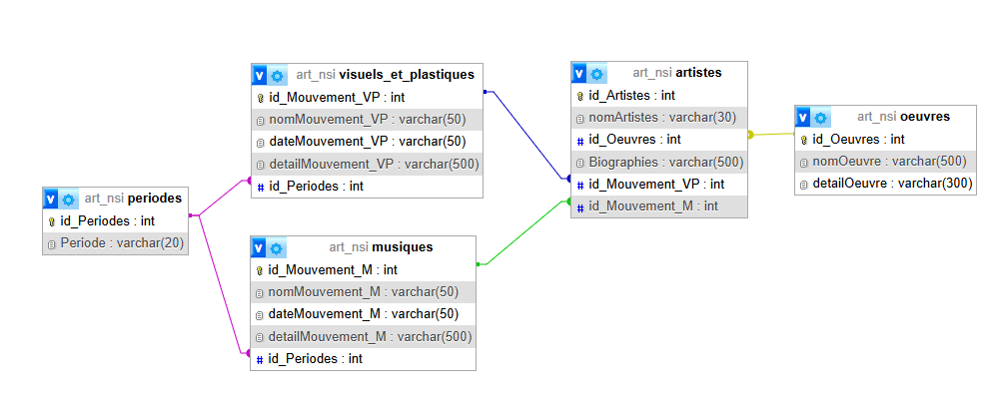

# Bubble Map - 2025

Développé sous python 3.11.9 sur Visual Studio Code

## 💻 Touches
- **Clique molette (maintenir) :** Déplacement dans la BubbleMap.
- **Clique gauche :** Affichage des périodes/mouvements/artistes en cliquant sur une bulle.
- **Clique droit :** Affichage du détail d'un mouvement/d'un artiste/d'une oeuvre en cliquant sur une bulle.
- **Molette avant/arrière :** Zoomer/Dézoomer la BubbleMap.

Schéma relationnel de la base de données

