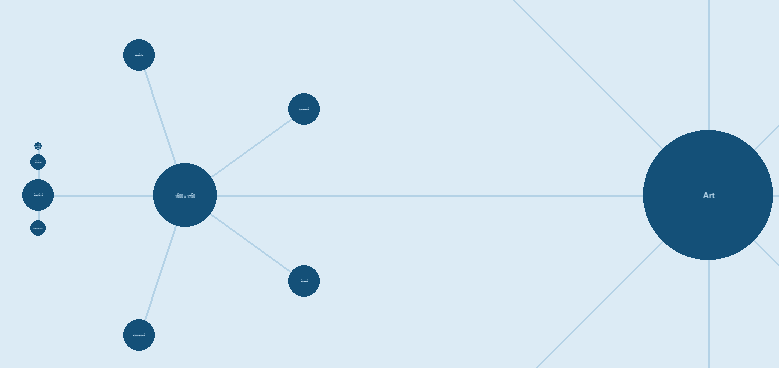
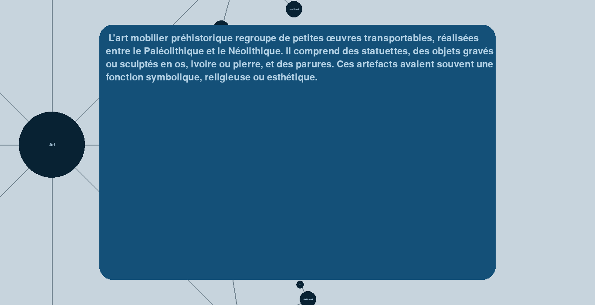

# Bubble Map - 2025

Développé sous [python](https://www.python.org/downloads/) __3.11.9__ sur [Visual Studio Code](https://code.visualstudio.com/)

## 💻 Touches
- **Clique molette (maintenir) :** Déplacement dans la BubbleMap.
- **Clique gauche :** Affichage des périodes/mouvements/artistes en cliquant sur une bulle.
- **Clique droit :** Affichage du détail d'un mouvement/d'un artiste/d'une oeuvre en cliquant sur une bulle.
- **Molette avant/arrière :** Zoomer/Dézoomer la BubbleMap.

## Schéma relationnel de la base de données

## Exemple d'un chemin sur la BubbleMap

## Exemple du détail d'une bulle

## Carte entièrement développée

